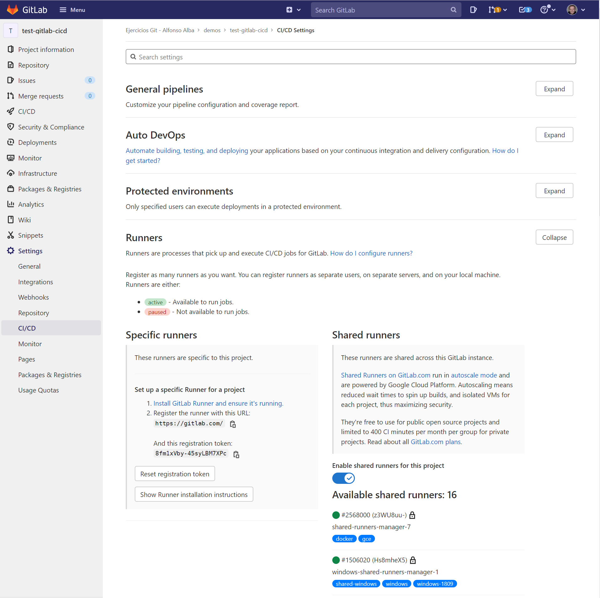
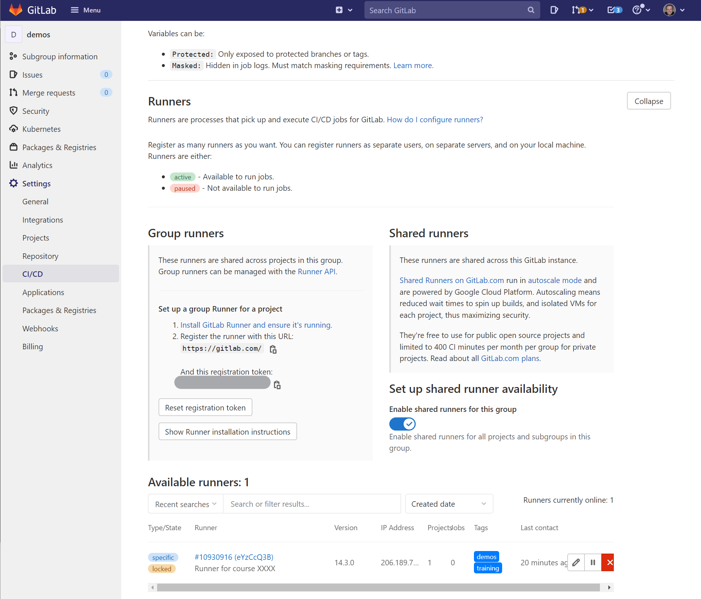

# Registrar el runner

Accede a tu cuenta de gitlab a través de la [página de login](https://gitlab.com/users/sign_in).

## Tipos de _runners_

Los _runners_ se pueden configurar para que sean utilizados por:

* Todos los proyectos (_shared runner_): Ir a _Overview -> Runners_
* Un grupo de proyectos (_group runner_): Ir a _Settings -> CI/CD -> Runners_ en el menú del grupo
* Por un único proyecto (_project-specific runner_): Ir a _Settings -> CI/CD -> Runners_ en el menú del proyecto
* Ver [The scope of runners (GitLab docs)](https://docs.gitlab.com/ee/ci/runners/runners_scope.html)

En este laboratorio, daremos de alta un _runner_ que será utilizado por un proyecto de ejemplo que crearemos en 
el siguiente paso.

## Crear un proyecto

Ve a la [sección proyectos de tu cuenta](https://gitlab.com/dashboard/projects) y crea un nuevo proyecto. 
En este tutorial nos referiremos a este proyecto
como `test-gitlab-cicd`.

Puedes hacerlo público o privado, para este ejemplo será irrelevante la opción que escojas. Con objeto de
que el repositorio no esté vacío, marcaremos la opción para que cree un fichero `README.md`.

También puedes crear un [grupo](https://docs.gitlab.com/ee/user/group/) llamado `laboratorios` dentro de cuenta 
y crear el repositorio dentro de este grupo. Esta es una manera muy práctica de mantener tus repositorios
ordenados.

## Obtener el token

* Ir a la página del proyecto en GitLab
* En el menú del proyecto, en la parte izquierda de la pantalla, selecciona _Settings -> CI/CD_
* Despliega la sección _Runners_



## Registrar el _runner_

* Copia el token de registro que nos facilita GitLab
* Acceder por ssh a tu máquina virtual (deberías haber recibido los datos de acceso antes de realizar el taller):

```
$ ssh -i userX_id_rsa root@IP
```

* Registra el _runner_ utilizando el siguiente comando:

```
sudo gitlab-runner register
Runtime platform                                    arch=amd64 os=linux pid=42880 revision=b37d3da9 version=14.3.0
Running in system-mode.

Enter the GitLab instance URL (for example, https://gitlab.com/):
https://gitlab.com/

Enter the registration token:
XXXXXXXXXXXXXXX

Enter a description for the runner:
[droplet-for-user1]: Runner for course XXXX

Enter tags for the runner (comma-separated):
training,demos,java,maven

Registering runner... succeeded                     runner=QyWS9gVP

Enter an executor: docker, shell, docker+machine, kubernetes, docker-ssh+machine, custom, docker-ssh, parallels, ssh, virtualbox:
shell

Runner registered successfully. Feel free to start it, but if it's running already the config should be automatically reloaded!
```

Durante la ejecución del comando se nos harán las siguientes preguntas:
* GitLab instance URL: URL de nuestra instancia de GitLab. Dado que para este laboratorio utilizaremos la infraestructura pública
  de GitLab, rellenaremos `https://gitlab.com`, como se nos indica en la página de configuración de los _runners_ del proyecto
* Registration token: Introducir el token facilitado por GitLab en la página de configuración de los _runners_ del proyecto 
  (ver captura de pantalla anterior)
* Description: introduce una descripción para el _runner_. Esta será visible en la web de GitLab
* Tags: introduce los tags, separados por comas. Los trabajos de nuestros _pipelines_ utilizan estos tags para [seleccionar en qué
  _runner_ ejecutarse](`/etc/gitlab-runner/config.toml`).
* Executor: por último, debemos seleccionar qué mecanismo utilizará GitLab para ejecutar los trabajos dentre de este _runner_.
  De todas las opciones disponibles, seleccionaremos `shell`. 
  En [esta página](https://docs.gitlab.com/runner/executors/index.html) puedes acceder a todos los _executors_ disponibles

En este laboratorio utilizaremos el executor `shell`. Para poder utilizarlo, nuestra máquina virtual deberá contener
todo el software necesario para ejecutar los trabajos definidos en nuestros _pipelines_. Dado que para este laboratorio
no necesitamos nada especial más allá de `bash`, no necesitaremos instalar ningún software adicional dentro de nuestra
máquina virtual.

Podemos ver el estado del runner ejecutando los siguientes comandos:

```
$ gitlab-runner status
Runtime platform                                    arch=amd64 os=linux pid=43488 revision=b37d3da9 version=14.3.0
gitlab-runner: Service is running

$ gitlab-runner list
Runtime platform                                    arch=amd64 os=linux pid=43496 revision=b37d3da9 version=14.3.0
Listing configured runners                          ConfigFile=/etc/gitlab-runner/config.toml
Runner for course XXXXXX                              Executor=shell Token=XXXXXXXXXXXXXXXXXXXX URL=https://gitlab.com/
```

Una vez registrado el _runner_, volvemos a la página de confguración del proyecto en GitLab, donde deberíamos poder verlo:





## Cambiar configuración del runner

Por defecto, los _runners_ están configurados para que únicamente ejecuten tareas de nuestro _pipeline_ con el 
[tag adecuado](https://docs.gitlab.com/ee/ci/runners/configure_runners.html#use-tags-to-control-which-jobs-a-runner-can-run).
Vamos a configurar nuestro _runner_ para que ejecute cualquier tipo de trabajo:

* Ir a la página de configuración del los _runners_ del proyecto
* Editar el _runner_ que creamos anteriormente
* Marcar la opción _"Run untagged jobs"_
* Guardar los cambios

## Configuración avanzada

Como hemos visto antes, los _runners_ de GitLab se ejecutan como un 
[servicio](https://docs.gitlab.com/runner/configuration/init.html) dentro de nuestra máquina virtual. El fichero de configuración
del runner puede encontrarse en:
* **systemd**: `/etc/systemd/system/gitlab-runner.service`
* **upstart**: `/etc/init/gitlab-runner`

El fichero de configuración del servicio está en `/etc/gitlab-runner/config.toml`.

* Editar el fichero `/etc/gitlab-runner/config.toml`
* Cambiar la descripción
* Recargar el servicio: `systemctl reload gitlab-runner`
* Ver el cambio:

```bash
$  gitlab-runner list
Runtime platform                                    arch=amd64 os=linux pid=43470 revision=b37d3da9 version=14.3.0
Listing configured runners                          ConfigFile=/etc/gitlab-runner/config.toml
Runner for course YYYY                              Executor=shell Token=XXXXXXXXXXXXXXXXXX URL=https://gitlab.com/
```

El fichero de configuración soporta múltiples opciones para configurar el _runner_. Por ejemplo, 
si utilizamos `docker` como _executor_ podríamos configurar un _runner_ para que ejecutase más de una tarea de forma
simultánea, cada una de ellas aislada dentro de contenedores. Puedes ver todos los detalles de la configuración de los
_runners_ en la sección 
["Configuración de runners" dentro de la documentación de GitLab](https://docs.gitlab.com/runner/configuration/)
 
## GitLab Build Cloud Runners

Servicio ofrecido por GitLab para los clientes de su servicio SaaS.
La ventaja de estos _runners_ es que no requieren configuración previa ya que se utilizan la infraestrucutra de GitLab. El servicio
lleva años funcionando con Linux, estando Windows y macOS con soporte en beta en el momento en el que se desarrolló este laboratorio.

El servicio tiene una 
[quota](https://docs.gitlab.com/ee/user/admin_area/settings/continuous_integration.html#shared-runners-pipeline-minutes-quota) 
basada en minutos de procesador que dependen del plan contratado. 

[Más información aquí](https://docs.gitlab.com/ee/ci/runners/). Este laboratorio se podría haber realizado utilizando
este servicio. 

## Resumen de enlaces

* [Registering runners (GitLab docs)](https://docs.gitlab.com/runner/register/)
* [The scope of runners (GitLab docs](https://docs.gitlab.com/ee/ci/runners/runners_scope.html)
* [Groups (GitLab docs)](https://docs.gitlab.com/ee/user/group/)
* [Executors (GitLab docs)](https://docs.gitlab.com/runner/executors/index.html)
* [GitLab Build Cloud runners](https://docs.gitlab.com/ee/ci/runners/)
* [Tags to control jobs run inside a runner (GitLab docs)](https://docs.gitlab.com/ee/ci/runners/configure_runners.html#use-tags-to-control-which-jobs-a-runner-can-run)
