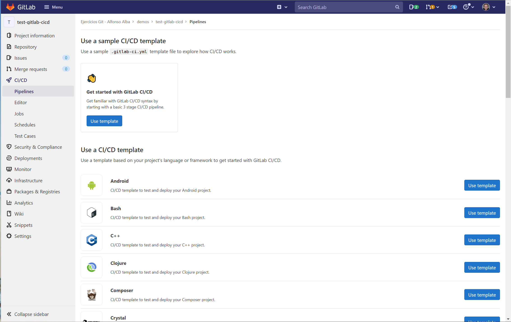
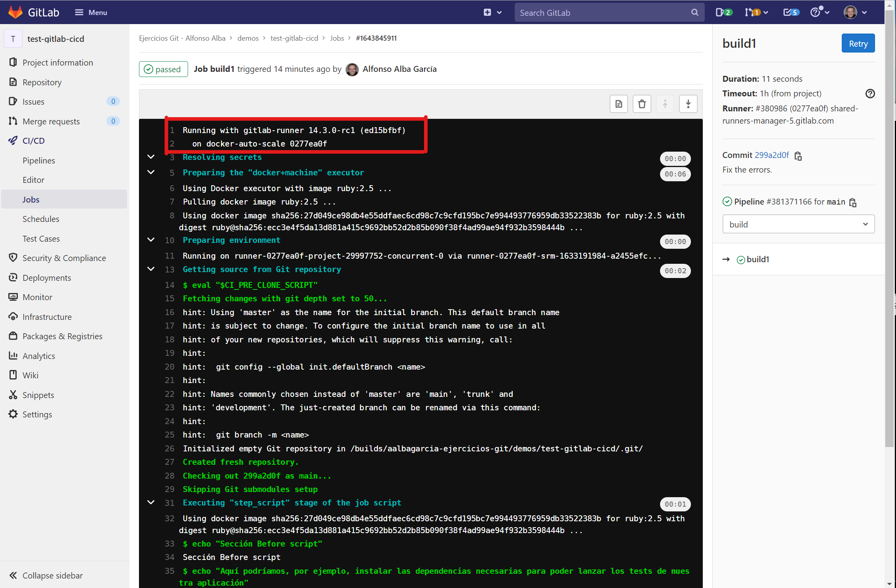
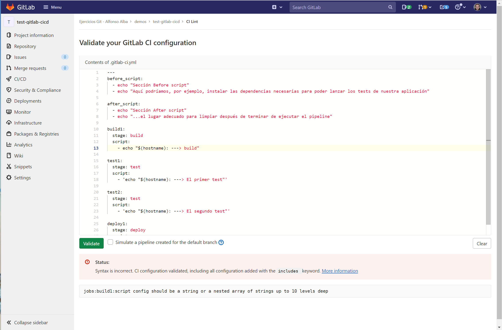

# Añadir un _pipeline_

Una vez tenemos registrado nuestro _runner_ en el proyecto, podemos crear el _pipeline_
que ejecutaremos en él.

## Antes de empezar...

Ir a la página del proyecto en GitLab y en el menú de la izquierda ir a _CI/CD -> Pipelines_

Veremos que no tenemos en este momento ningún pipeline activo en el proyecto:



Denominaremos a esta página como "Página de _pipelines_ del proyecto".

## Crear el fichero 

Por defecto, el fichero de definición de un _pipeline_ es `/.gitlab-ci.yml`.

En nuestro repositorio `test-gitlab-cicd` (que creamos en el [paso 3](../3-register-the-runner/README_es.md)), añadimos
el fichero `./gitlab-ci.yml`: 

```yaml
---
before_script:
  - echo "Sección Before script"
  - echo "Aquí podríamos, por ejemplo, instalar las dependencias necesarias para poder lanzar los tests de nuestra aplicación"

after_script:
  - echo "Sección After script"
  - echo "...el lugar adecuado para limpiar después de terminar de ejecutar el pipeline"

build1:
  stage: build
  script:
    - 'echo "$(hostname): ---> build"'

test1:
  stage: test
  script:
    - 'echo "$(hostname): ---> El primer test"'

test2:
  stage: test
  script:
    - 'echo "$(hostname): ---> El segundo test"'

deploy1:
  stage: deploy
  script:
    - 'echo "$(hostname): ---> ¡Desplegamos!"'
```

(Importante leer [esta página de documentación](https://docs.gitlab.com/ee/ci/yaml/script.html) 
en la que se nos dan indicaciones importantes a la hora de escribir scripts dentro de los _pipelines_ de GitLab).

Una vez creado el fichero, hacer push:

```bash
$ git push
```

Si volvemos a la página de _pipelines_ del proyecto, veremos que se ha ejecutado nuestro _pipeline_. Si hacemos click sobre el
ID del _pipeline_ en el listado, accederemos a la página del mismo en el que podremos ver:
* Pestaña _Pipeline_: Las tres etapas que hemos definido en el fichero y dentro de cada etapa, los trabajos que se han ejecutado.
* Pestaña _Jobs_: Listado con todos los trabajos y su correspondiente estado.
* Pestaña _Tests_: vacía ya que por el momento, nuestro _pipeline_ no genera informes con resultados de tests. 

## Seleccionar el _runner_

Si accedemos a la salida por consola del pipeline, veremos que esta **no se ha ejecuado en nuestro runner:**



Soluciones:

* Ir a _Settings -> CI/CD -> Runners_ y deshabilitar los _runners_ compartidos.
* Modificar el pipeline para que los trabajos se ejecuten en el _runner_ adecuado.

Seleccionaremos el _runner_ correcto modificando el fichero `/.gitlab-ci.yml`:

* Antes de modificar el fichero, ir al proyecto, _Settings -> CI/CD ->Runners_, editar el _runner_ 
  y añadir el tag `nuestrorunner`
* Modificar el pipeline para indicarle a los trabajos dónde deben ejecutarse:

```yaml
before_script:
  - echo "Sección Before script"
  - echo "Aquí podríamos, por ejemplo, instalar las dependencias necesarias para poder lanzar los tests de nuestra aplicación"

after_script:
  - echo "Sección After script"
  - echo "...el lugar adecuado para limpiar después de terminar de ejecutar el pipeline"

build1:
  stage: build
  script:
    - 'echo "$(hostname): ---> build"'
  tags:
    - nuestrorunner
    - linux
test1:
  stage: test
  script:
    - 'echo "$(hostname): ---> El primer test"'
  tags:
    - nuestrorunner
    - linux

test2:
  stage: test
  script:
    - 'echo "$(hostname): ---> El segundo test"'
  tags:
    - nuestrorunner
    - linux

deploy1:
  stage: deploy
  script:
    - 'echo "$(hostname): ---> ¡Desplegamos!"'
  tags:
    - nuestrorunner
    - linux
```

* Hacer commit y un push de este cambio. 

Después de hacer push, se ejecutará de nuevo el _pipeline_, aunque esta vez en nuestros _runners_.

## Ejecución manual

Los _pipelines_ pueden ejecutarse de manera manual. Para ello:

* Ir a la página de _pipelines_ del proyecto.
* Hacer click sobre el botón _Run pipeline_ situado en la parte superior izquierda.
* Seleccionar la rama a utilizar.
* Lanzar la ejecución haciendo click sobre el botón _Run pipeline_.

## Contexto

El script del pipeline se ejecuta dentro del runner, dentro de un directorio que contiene un checkout de la rama seleccionada.

Para ilustrarlo, haremos la siguiente prueba dentro del repositorio `test-gitlab-cicd`

* Crear una rama `feature-1723`
* Añadir el siguiente script `test.sh` en shell a esa rama:

```bash
#!/bin/env bash

cat << "EOF"
¡Estoy haciendo algunos tests!

 _._     _,-'""`-._
(,-.`._,'(       |\`-/|
    `-.-' \ )-`( , o o)
          `-    \`_`"'-
EOF
```

* Modifica el trabajo `build1` de nuestro pipeline (`.gitlab-ci.yml`) y añade los comandos `pwd` y `ls`:

```yaml
build1:
  stage: build
  script:
    - 'echo "$(hostname): ---> build"'
    - pwd
    - ls -a

  tags:
    - nuestrorunner
    - linux
```

* Modifica el trabajo `test2` de nuestro pipeline (`.gitlab-ci.yml`) para que ejecute el script:

```yaml
test2:
  stage: test
  script:
    - bash test.sh
  tags:
    - nuestrorunner
    - linux
```


* Haz push de esta rama:

```bash
$ git push -u origin feature-1723
```

* Ir a la página de _pipelines_ del proyecto y ver cómo el trabajo `test2` ha ejecutado el script
  contenido en el repositorio. También buscar la salida del trabajo `build1`, que nos muestra la 
  salida de los comandos `pwd` y `ls ´-a`

## CI Linter

GitLab dispone de un _linter_ para ayudarnos a depurar los errores de syntaxis del nuestros _pipelines_.

Para acceder al él, ir a la página del proyecto en GitLab y en el menú de la izquierda ir a 
_CI/CD -> Pipelines_. En esa página, acceder al botón _CI Lint_ disponible en la parte superior izquierda.



## Documentación:

* [Tipos de pipelines](https://docs.gitlab.com/ee/ci/pipelines/#types-of-pipeline)
* [Referencia del fichero `.gitlab-ci.yml`](https://docs.gitlab.com/ee/ci/yaml/gitlab_ci_yaml.html)
* [Ejemplos de _pipelines_ para múltiples lenguajes](https://docs.gitlab.com/ee/ci/examples/)
